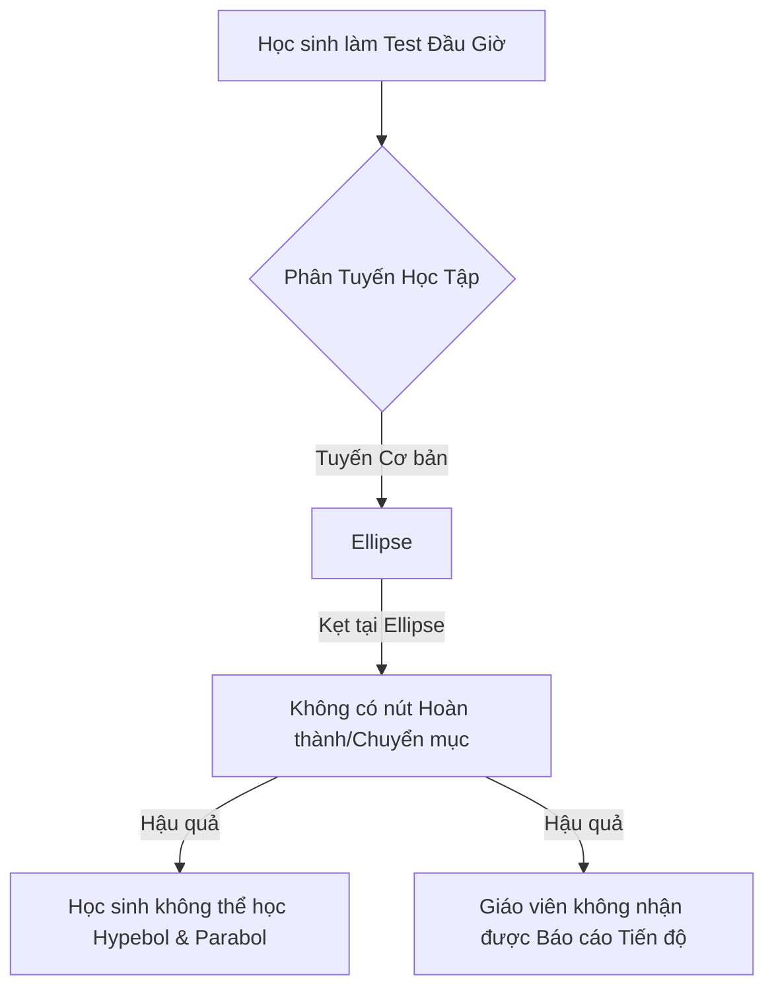

# Báo Cáo Kiểm Thử & Đánh Giá Chất Lượng (QA Report)
## Cổng Học Sinh Tự Thích Ứng (Adaptive Portal) — Bài Học: Ba Đường Conic (Toán 10)

- **Địa chỉ kiểm thử:** [https://giaoandewey.vercel.app/adaptive-portal/adaptive-1780109144041](https://giaoandewey.vercel.app/adaptive-portal/adaptive-1780109144041)
- **Ngày thực hiện:** 30/05/2026
- **Môi trường:** Production Web App
- **Đối tượng kiểm thử:** Luồng học sinh tự thích ứng (Student Adaptive Flow), giao diện hiển thị, hiển thị công thức toán (LaTeX), logic phân hoá & tương tác hình học trực quan.

---

## 1. Tổng Quan Hệ Thống Đối Chiếu Với Yêu Cầu Thiết Kế

Theo tài liệu [adaptive_learning_design.md](file:///c:/Users/ADMIN/Downloads/smart-lesson-plan-ai/adaptive_learning_design.md), hệ thống bài học phân hoá cần đảm bảo các nguyên tắc sư phạm cốt lõi:
*   **Phân hoá theo mục tiêu nhỏ:** Chia bài học thành các mảnh mục tiêu, chẩn đoán qua bài test đầu giờ và phân tuyến cá nhân hoá.
*   **Không lặp vô hạn / Không gây bế tắc:** Luồng học sinh phải rõ ràng, kết thúc mỗi mảnh kiến thức cần có cơ chế chuyển bước hoặc báo giáo viên hỗ trợ.
*   **Trực quan hoá & Trải nghiệm premium:** Trực quan hóa các khái niệm Toán học (Ellip, Hypebol, Parabol) thông qua các công cụ mô phỏng động, hiển thị công thức đẹp mắt, giao diện chuyên nghiệp.

> [!IMPORTANT]
> **KẾT LUẬN CHUNG:** Trải nghiệm hiện tại của cổng học sinh **đang gặp một số lỗi nghiêm trọng ở mức độ chặn luồng học tập (Critical Blocker)** và **sai lệch nghiêm trọng về mặt toán học trong mô phỏng động (High Logic Bug)**. Dưới đây là phân tích chi tiết dưới hai góc độ: **Học sinh đang trải nghiệm học** và **Giáo viên thiết lập bài học**.

---

## 2. Đánh Giá Chi Tiết Dưới Góc Độ Học Sinh (Student Perspective)

Học sinh đóng vai trò là người trực tiếp trải nghiệm bài học, tương tác với các nội dung lý thuyết, công cụ trực quan và làm bài kiểm tra. Dưới góc nhìn này, các lỗi sau đây gây ảnh hưởng tiêu cực nặng nề đến tâm lý và hiệu quả học tập:

### A. Lỗi Nghiêm Trọng / Khóa Luồng Học (Critical & High Bugs)

#### 1. Lỗi kẹt luồng học - Không thể hoàn thành bài học (CRITICAL BLOCKER)
*   **Mô tả:** Sau khi học sinh hoàn thành **Phần 1 (Phản hồi mục tiêu)** và **Phần 2 (Thử và sửa bài tập ví dụ)** của nội dung Đường Ellipse, ở cuối thẻ bài học bên trái hoàn toàn **không xuất hiện bất kỳ nút "Hoàn thành", "Tiếp tục" hay "Chuyển bước" nào** để ghi nhận tiến độ.
*   **Hậu quả:** Trên thanh **Mục lục (Table of Contents)** ở sidebar trái, các phần tiếp theo bao gồm `4. Đường Hypebol` và `5. Đường Parabol` vẫn ở trạng thái chữ màu xám và bị khóa (`disabled`). Học sinh bị **mắc kẹt vĩnh viễn** ở trang này và không có cách nào tự mình đi tiếp để hoàn thành bài học.
*   **Giao diện minh họa lỗi kẹt:**
    ```text
    [ Thẻ bài học Ellipse ]
    ...
    (Nội dung ví dụ mẫu đã xem xong)
    -----------------------------
    < Không có nút hành động tiếp theo ở đây >
    ```

#### 2. Lỗi sai lệch toán học trong mô phỏng động Ellipse (HIGH LOGIC BUG)
*   **Mô tả:** Trình mô phỏng trực quan vẽ Ellipse cho phép học sinh điều chỉnh thanh trượt (slider) cho bán trục lớn $a$ và bán trục nhỏ $b$.
    *   Các thanh trượt hiển thị thang đo thực tế ở mức hàng trăm: $a = 150$, $b = 100$.
    *   Tuy nhiên, phần tính toán kết quả tự động hiển thị bên dưới lại lấy giá trị **bị chia cho 10** ($a = 15$, $b = 10$).
    *   Hệ thống in ra màn hình: `Tiêu cự 2c: 11.18` (kết quả của $2\sqrt{15^2-10^2} \approx 11.18$) và kết luận: `Tổng khoảng cách MF1 + MF2 luôn bằng 2a = 15.00`.
*   **Hậu quả:** Một học sinh kéo slider bán trục lớn lên $150$ nhưng hệ thống lại bảo tổng khoảng cách bằng $15$. Điều này **sai lệch hoàn toàn về mặt toán học và logic hình học**, khiến học sinh bị hiểu sai lệch kiến thức cơ bản giữa thang đo đồ họa và giá trị đại số thực tế.

#### 3. Lỗi rò rỉ mã nguồn LaTeX thô (HIGH UI/UX BUG)
*   **Mô tả:** Hệ thống không parse được các công thức Toán học dạng inline sử dụng một ký hiệu đô-la `$`. Hàng loạt công thức toán học quan trọng hiển thị dưới dạng code raw LaTeX thô thiển.
*   **Các vị trí phát hiện:**
    *   Hiển thị các ký hiệu đơn lẻ: `$a$`, `$b$`, `$c$`, `$F_1, F_2$`.
    *   Hiển thị hệ thức Ellipse: `$MF_1 + MF_2 = 2a$`, `$2a > F_1F_2 = 2c$`, `$c^2 = a^2 - b^2$`.
    *   Lời giải bài tập: `$a^2 = 25 \implies a = 5$`, `$b^2 = 9 \implies b = 3$`.
*   **Hậu quả:** Học sinh phổ thông không được học lập trình LaTeX sẽ cảm thấy cực kỳ rối mắt, giao diện mất đi vẻ premium và chuyên nghiệp vốn có của một sản phẩm EdTech thời đại mới.

#### 4. Lỗi ký tự đô-la lạ rác trong công thức toán (MEDIUM UI)
*   **Mô tả:** Ở phần lời giải chi tiết (bước giải từng bước của phần Thử và sửa bài tập), công thức toán hiển thị ký tự đô-la `$4` nằm xen giữa các biểu thức số học một cách bất thường:
    *   *Công thức lỗi:* `25(b^2 + $4) = 9b^2(b^2 + $4)`
*   **Hậu quả:** Làm sai lệch cú pháp toán, gây khó hiểu cho học sinh khi cố gắng chép lại bài giải.

---

### B. Trải Nghiệm Người Dùng (UX Flaws)

#### 5. Nút gợi ý rỗng (Hint Bug)
*   **Mô tả:** Trong phần luyện tập nhỏ của Ellip, học sinh bấm vào nút **"Kiểm tra gợi ý"**. Hệ thống đưa ra thông báo: *"So sánh câu trả lời của em với gợi ý dưới đây rồi tiếp tục học"* nhưng **không hề hiển thị bất kỳ dòng nội dung gợi ý hay lời giải mẫu nào** phía dưới.
*   **Hậu quả:** Nút bấm vô tác dụng, học sinh không biết mình làm đúng hay sai.

#### 6. Lỗi mất tài nguyên ảnh (Broken Image Link)
*   **Mô tả:** Ngay phần mở đầu giới thiệu Đường Ellipse ở Step 3, hệ thống hiển thị một khung chữ nhật màu vàng đất trống rỗng kèm theo một dấu hỏi chấm lớn `?` ở giữa. Đây là biểu hiện của việc link ảnh minh hoạ hoặc link nhúng mô phỏng địa chỉ tĩnh bị chết (broken asset resource).
*   **Hậu quả:** Giao diện trông như bị lỗi chưa hoàn thiện, làm giảm độ tin cậy của bài học.

#### 7. Vở ghi chép tự động bị lây nhiễm lỗi định dạng (Notebook Sync Issue)
*   **Mô tả:** Tính năng "Vở ghi chép của em" ở sidebar phải tự động đồng bộ hóa các kiến thức trọng tâm từ bài học. Tuy nhiên, toàn bộ lỗi hiển thị LaTeX thô và ký tự đô-la thừa (`$4`) ở bài học bên trái **bị sao chép nguyên vẹn** sang vở ghi chép bên phải.
*   **Hậu quả:** File ghi chép lưu lại của học sinh bị lỗi font và cú pháp, không sử dụng để ôn tập được.

#### 8. Trải nghiệm cuộn trang khó chịu (Nested Scrollbars UX)
*   **Mô tả:** Giao diện chia làm nhiều cột: Sidebar mục lục trái, Nội dung bài học chính ở giữa, Vở ghi chép bên phải. Hệ thống bố trí **3 thanh cuộn (scrollbar) lồng nhau độc lập**.
*   **Hậu quả:** Khi học sinh cuộn chuột hoặc vuốt touchpad, trang web cuộn rất giật cục. Người dùng rất dễ cuộn nhầm khu vực (ví dụ: muốn cuộn bài học nhưng lại cuộn trúng vở ghi chép hoặc ngược lại), gây khó chịu và ức chế trong quá trình sử dụng lâu dài.

---

## 3. Đánh Giá Dưới Góc Độ Giáo Viên (Teacher Perspective)

Giáo viên là người biên soạn giáo án nguồn, cài đặt mục tiêu học tập, theo dõi tiến độ của học sinh và can thiệp sư phạm khi học sinh gặp khó khăn. Dưới góc độ quản lý sư phạm, bài học phân hoá này có các điểm yếu sau:

### A. Logic Sư Phạm & Tính Phân Hoá (Pedagogical Logic Issues)



#### 1. Cơ chế phân hoá chưa thực sự "từng mục tiêu"
*   **Mô tả:** Mặc dù tài liệu kỹ thuật yêu cầu hệ thống phân tích trạng thái thành thạo (mastery status) theo từng mục tiêu học tập riêng biệt để phân hoá. Tuy nhiên trên thực tế, sau khi học sinh làm xong bài test chẩn đoán đầu giờ, hệ thống chỉ gán học sinh vào một **tuyến học chung duy nhất cho cả bài** (ví dụ: Tuyến chuẩn / Tuyến cơ bản).
*   **Hậu quả:** Nếu học sinh đã giỏi phần Ellipse nhưng yếu phần Parabol, hệ thống vẫn bắt học sinh học tuyến cơ bản cho cả 3 đường từ đầu đến cuối, chưa đạt được tiêu chí "phân hoá sâu theo từng đơn vị kiến thức nhỏ" đề ra trong thiết kế.

#### 2. Thiếu chẩn đoán sai lầm (Misconception Detection)
*   **Mô tả:** Bài test chẩn đoán đầu giờ của bài conic có các câu hỏi trắc nghiệm liên quan đến các lỗi sai kinh điển (như nhầm lẫn giữa dấu cộng trong phương trình Ellip và dấu trừ trong Hypebol, hay nhầm giá trị $a^2, b^2$ thành $a, b$). Tuy nhiên, khi học sinh trả lời sai, hệ thống chỉ chấm điểm đúng/sai thô sơ mà **không báo cáo cho học sinh hoặc giáo viên biết học sinh đang mắc phải sai lầm (misconception) cụ thể nào** để giáo viên có hướng can thiệp.

---

### B. Lỗi Giao Diện & Tiêu Chuẩn Kỹ Thuật (UI & Technical Flaws)

#### 3. Huy hiệu thông tin Header bị cắt méo (Header Badges Clipping)
*   **Mô tả:** Ở phần đầu trang (Header), các huy hiệu thông tin hiển thị trạng thái của học sinh bao gồm: "TIẾT HỌC", "MỤC TIÊU", "TUYẾN HỌC" cùng với số vòng tròn tương ứng ở phía trên bị đẩy quá sát lề trên.
*   **Hậu quả:** Phần trên của các vòng tròn và chữ bị **cắt mất một nửa (clipped)** bởi khung viền ngoài của Header, làm giao diện trông rất thiếu chỉn chu và lỗi kỹ thuật CSS rõ rệt.

#### 4. Lỗi trùng lặp DOM toán học (Math Accessibility Issue)
*   **Mô tả:** Tại câu hỏi số 2 của Bài test chẩn đoán đầu giờ (Step 2), trong mã nguồn DOM xuất hiện chuỗi công thức ẩn trùng lặp liên tiếp: `16x^2 - 9y^2 = 1` cùng tồn tại song song trong hai phần tử hiển thị.
*   **Hậu quả:** Gây lỗi cho các công cụ đọc màn hình dành cho học sinh khuyết tật (Screen Readers) và là điểm trừ về mặt tối ưu hóa giao diện chuẩn tiếp cận (Web Accessibility standards).

---

## 4. Bảng Tổng Hợp Lỗi & Mức Độ Ưu Tiên Khắc Phục (Bug Matrix)

| STT | Tên Lỗi | Góc Độ Ảnh Hưởng | Phân Loại | Mức Độ | Trạng Thái |
| :--- | :--- | :--- | :--- | :--- | :--- |
| 1 | **Kẹt luồng học Ellipse không thể đi tiếp** | Học sinh & Giáo viên | Logic / Chức năng | **CRITICAL** | Cần sửa gấp để tiếp tục học |
| 2 | **Lệch tỷ lệ bán kính mô phỏng Ellipse** | Học sinh | Toán học / Logic | **HIGH** | Gây hiểu sai kiến thức |
| 3 | **Raw LaTeX hiển thị ký tự đô-la thô** | Học sinh | Giao diện (UI) | **HIGH** | Mất mỹ quan EdTech |
| 4 | **Nút gợi ý rỗng (Không hiện nội dung)** | Học sinh | Trải nghiệm (UX) | **MEDIUM** | Mất tính năng gợi ý |
| 5 | **Ký tự đô-la lạ rác `$4` trong toán** | Học sinh | Dữ liệu / Hiển thị | **MEDIUM** | Gây nhầm lẫn công thức |
| 6 | **Huy hiệu Header bị cắt góc trên** | Giáo viên & Học sinh | CSS / Giao diện | **LOW** | Mất thẩm mỹ lề trên |
| 7 | **Nested Scrollbars (Thanh cuộn lồng nhau)** | Học sinh | Trải nghiệm (UX) | **LOW** | Thao tác cuộn giật cục |
| 8 | **Lỗi mất ảnh minh hoạ Ellip (?)** | Học sinh | Tài nguyên (Asset) | **LOW** | Trống nội dung trực quan |

---

## 5. Phân Tích Nguyên Nhân Gốc Rễ (Root Cause Analysis - Systemic Flaws)

Sau khi phân tích sâu kiến trúc mã nguồn, đây **KHÔNG PHẢI** là lỗi riêng của bài "Ba Đường Conic". Đây là các **Lỗi Hệ Thống (Systemic Bugs)** nằm ở tầng lõi sinh giao diện (Dewey Template) và bộ chuyển đổi dữ liệu (Adaptive Mapper). Bất kỳ bài học nào được sinh ra cũng sẽ gặp lỗi tương tự.

### 1. Lỗi kẹt luồng (Missing Next Button)
- **Vị trí:** `src/lib/dewey/template.ts` (hàm `renderSocraticStep`)
- **Nguyên nhân:** Cả thẻ `div` chứa từ khoá tham khảo và thẻ `button` chuyển bước đều được gán chung class `next-btn`. Khi học sinh bấm "Kiểm tra gợi ý", hàm `submitSocraticStep` trong `htmlShell.ts` dùng `step.querySelector('.next-btn')`. Do `querySelector` chỉ lấy phần tử đầu tiên (là thẻ `div`), nút chuyển bước thực sự vĩnh viễn không được xoá class `hidden` và hiện lên màn hình.

### 2. Lỗi gợi ý rỗng ("So sánh câu trả lời...")
- **Vị trí:** `src/lib/adaptive/adaptiveToDewey.ts` (dòng 88-105)
- **Nguyên nhân:** Khi map dữ liệu từ AdaptiveLesson sang DeweyKnowledgeUnit, trường `feedback` của SocraticStep bị **hard-code** thành chuỗi tĩnh: `'So sánh câu trả lời với gợi ý rồi tiếp tục.'`. Toàn bộ nội dung giải thích đã bị nhồi hết vào phần `prompt`. Do đó, nút "Kiểm tra gợi ý" mất đi chức năng vốn có của nó.

### 3. Lỗi rò rỉ mã LaTeX thô
- **Vị trí:** `src/lib/dewey/template.ts` và `src/lib/dewey/htmlShell.ts`
- **Nguyên nhân:** Dữ liệu HTML của iframe được render thông qua các template string sử dụng `escapeHtml(value)` mà KHÔNG trải qua bất kỳ bộ parse Markdown/LaTeX nào ở tầng server/React. Toàn bộ việc render phó mặc cho script CDN của MathJax chạy ngầm bên trong iframe. Cùng với việc iframe bị giới hạn bởi `sandbox="allow-scripts allow-same-origin"`, việc khởi tạo và cập nhật lại DOM bằng `MathJax.typesetPromise()` diễn ra thiếu ổn định, gây rò rỉ toàn bộ mã `$a$`, `$b$`.

### 4. Lỗi sai lệch Toán học của mô phỏng động
- **Vị trí:** Tầng Prompt Engineering sinh nội dung (VD: `src/services/adaptiveLessonService.ts` hoặc các template sinh code AI).
- **Nguyên nhân:** AI thiếu ràng buộc khắt khe về việc đồng bộ "Tỷ lệ hệ trục toạ độ đồ hoạ (Canvas scale)" và "Giá trị đại số tính toán (Math logic)", cũng như thiếu chỉ thị cấm AI tự ý sinh ra ký hiệu `$` lẫn lộn trong các biểu thức số (như tự động sinh `$4`).

---

## 6. Khuyến Nghị Trực Tiếp Cho Đội Ngũ Phát Triển (Dành cho VSCode Agent)

Để khắc phục triệt để lỗi chặn luồng và giao diện cho **TẤT CẢ** các bài học phân hoá hiện tại và tương lai, hệ thống cần được can thiệp ở tầng mã nguồn. Bạn (VSCode Agent) hãy thực hiện ngay các chỉnh sửa sau:

1.  **Sửa lỗi kẹt luồng (Critical):**
    - Trong `src/lib/dewey/template.ts` (hàm `renderSocraticStep`), hãy đổi class của div chứa keyword từ `next-btn` thành `keyword-box`.
    - Trong `src/lib/dewey/htmlShell.ts` (hàm `submitSocraticStep`), cập nhật logic: query `.next-btn` để show nút chuyển bước và query thêm `.keyword-box` để show khung từ khoá (nếu có).
2.  **Khắc phục Nút gợi ý rỗng:**
    - Trong `src/lib/adaptive/adaptiveToDewey.ts`, hãy xoá bỏ dòng hard-code `feedback: 'So sánh câu...'`. Bạn cần map chính xác nội dung `explanation` hoặc `hints` do AI sinh ra vào trường `feedback` của cấu trúc dữ liệu.
3.  **Xử lý lỗi Render LaTeX (Architecture flaw):**
    - Tối ưu lại cơ chế gọi `updateMath` trong `htmlShell.ts`. Đảm bảo `MathJax.typesetPromise()` xử lý triệt để các chuỗi `$inline$` và `$$block$$`. Nếu MathJax liên tục bị chặn bởi CSP hoặc sandbox, cân nhắc pre-render LaTeX bằng KaTeX ở tầng server/React (`adaptiveToDewey.ts`) thay vì render on-the-fly ở client.
4.  **Cập nhật System Prompt (Prompt Engineering):**
    - Thêm chỉ thị nghiêm ngặt vào logic sinh bài học: *"Tuyệt đối không dùng ký hiệu đô-la bên trong các biểu thức số học đơn lẻ (ví dụ: không viết `$4`). Mọi mô phỏng hình học sinh ra (HTML/JS/SVG) phải có một hằng số SCALE đồng nhất giữa giao diện trực quan và logic text tính toán."*
5.  **Tối ưu CSS Layout:**
    - Ở file `src/pages/AdaptiveStudentPortalPage.tsx`, xử lý lại phần Header để không bị cắt xén (clipped) các huy hiệu, và sử dụng `overflow` hợp lý để loại bỏ triệt để các thanh cuộn lồng nhau (Nested Scrollbars).
