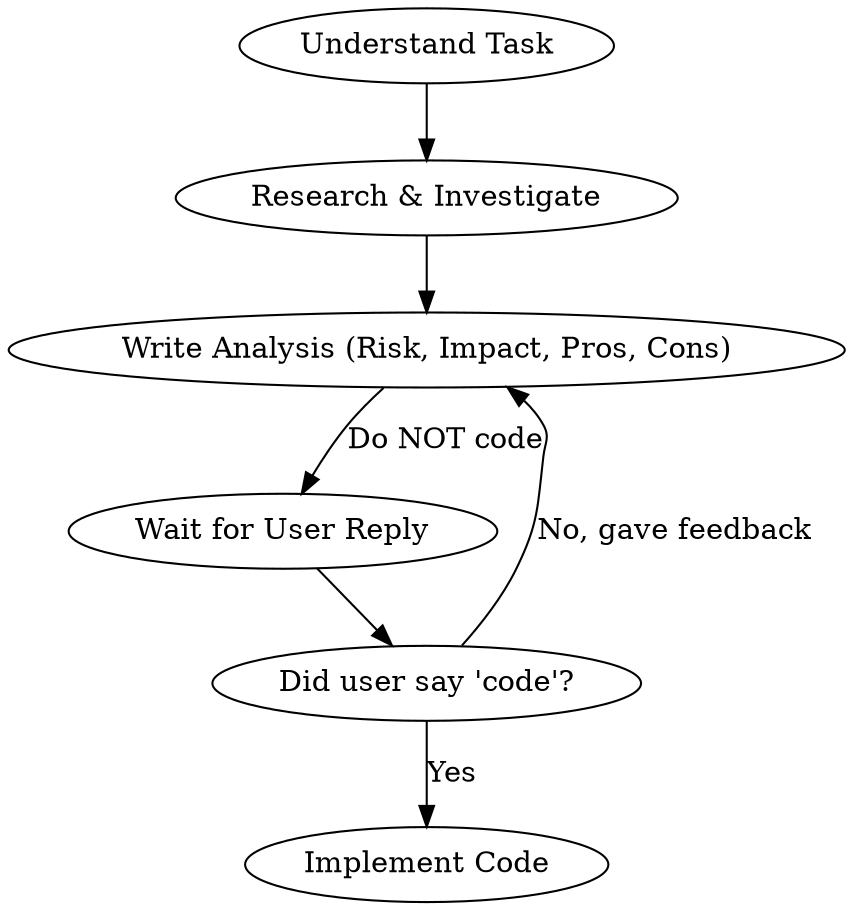

# Strict Approval Workflow

## Overview
This skill enforces a strict approval-based workflow where you MUST NOT edit any code until the user explicitly approves your analysis and plan. You must analyze the risks, impact, pros, and cons of your proposed solution and wait for the explicit command to code.

## When to Use
- Whenever you are asked to fix a bug, implement a feature, or refactor code.
- Before modifying any files (using `replace_file_content` or `write_to_file`).
- Before executing terminal commands that modify the codebase.

## Core Rules

**DO NOT WRITE CODE IMMEDIATELY.** You must complete these steps in order:

### 1. Analyze & Propose (The Analysis Phase)
Provide a detailed analysis of the problem and your proposed solution in Vietnamese (or the language the user is speaking). Your analysis **MUST** explicitly cover these 4 aspects:
- **Mức độ rủi ro (Risk Level)**: Đánh giá rủi ro (Thấp/Trung bình/Cao) và giải thích tại sao.
- **Ảnh hưởng đến các chức năng khác (Impact)**: Giải thích những component hoặc file nào có thể bị ảnh hưởng bởi thay đổi này.
- **Ưu điểm (Pros)**: Lợi ích của phương án giải quyết.
- **Nhược điểm (Cons)**: Điểm trừ, trade-offs, tech-debt hoặc hệ lụy tương lai.

### 2. Wait for Approval (The Waiting Phase)
End your response by asking the user to review the analysis. **DO NOT** write any implementation code in this turn. Wait for the user's response.

### 3. Execution (The Coding Phase)
You can ONLY start coding when the user replies with explicit approval (e.g., "code", "duyệt", "tiến hành", "ok code đi").

## Red Flags - STOP and Start Over
If you find yourself thinking any of these, STOP:
- "The fix is just one line, I'll just change it quickly." -> **Reality**: The user explicitly forbade this. Analyze first.
- "I'll provide the analysis AND the code edit in the same turn to save time." -> **Reality**: Violation of the workflow. You must WAIT for the user's turn.
- "The user said 'that makes sense', so I'll code now." -> **Reality**: Ask for the explicit command to code.

## Quick Reference Workflow

## The Bottom Line
Never assume permission to modify the codebase. Analyze, Present, Wait, Code.
