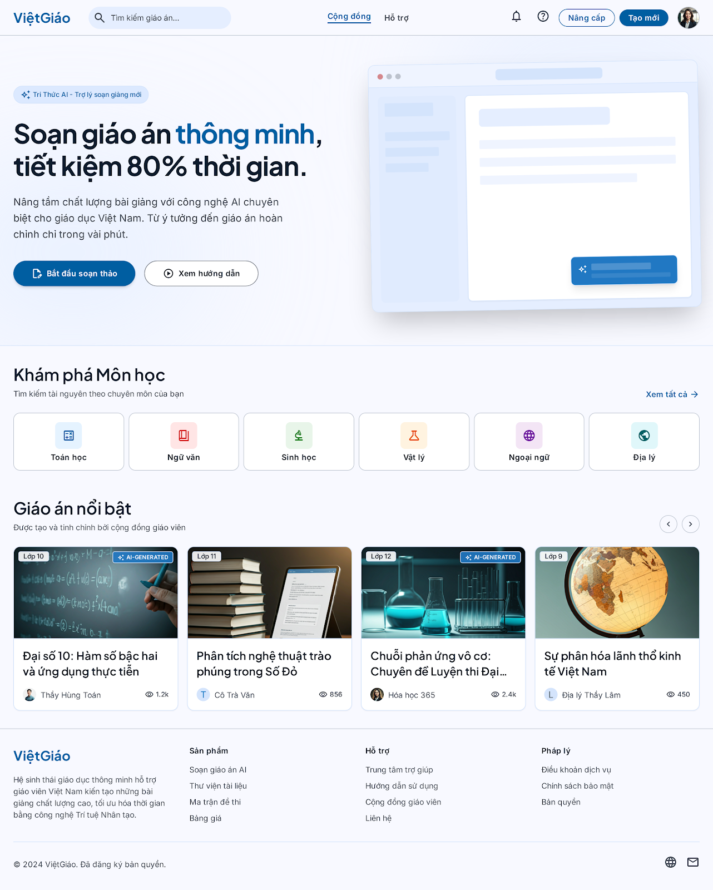
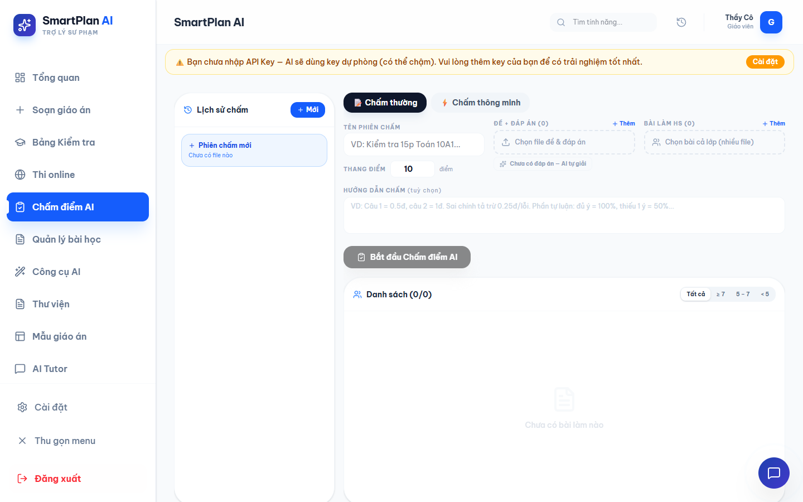

# Báo cáo Đối chiếu & Đánh giá UI/UX: Vercel vs. Stitch Redesign

Tài liệu này tổng hợp hình ảnh giao diện thực tế hiện tại của ứng dụng **Giao An Dewey** (chạy trên https://giaoandewey.vercel.app/) đối chiếu với các bản thiết kế cải tiến mới đã được xuất bản từ **Google Stitch** trong thư mục `C:\Users\ADMIN\Downloads\smart-lesson-plan-ai\UI-UX\_extracted`.

---

## 1. Tổng quan Hệ thống Thiết kế "Xanh Dương Tri Thức"

Hệ thống thiết kế mới của **Giao An Dewey** được xây dựng xung quanh các yếu tố cốt lõi:
- **Màu sắc chủ đạo:** Xanh Dương Tri Thức (`#3182CE` làm Primary Blue) kết hợp với Azure Mist làm nền phụ, Deep Navy cho tiêu đề độ tương phản cao, và các tông pastel nhẹ nhàng cho các thẻ phân loại môn học.
- **Typography:** Sử dụng **Plus Jakarta Sans** cho các tiêu đề lớn/vừa (headline) nhằm mang lại cảm giác hình học hiện đại, thân thiện, và **Inter** cho phần nội dung chi tiết, nhãn nút (labels) để tối ưu khả năng đọc.
- **Bo góc & Khoảng cách (Spacing & Radius):** Bo góc tiêu chuẩn `8px` (`rounded-xl` cho card lớn `16px`), khoảng cách chia theo hệ số 8px tuyến tính giúp giao diện thoáng đãng, cấu trúc rõ ràng.

---

## 2. Chi tiết Đối chiếu & Đánh giá Từng Màn hình

### Màn hình 1: Trang đăng nhập & Trang chủ
*Đối chiếu giữa màn hình đăng nhập tối giản hiện tại và thiết kế Landing Page đồng bộ thương hiệu.*

* **Giao diện hiện tại (Vercel):**
  
* **Thiết kế mới (Stitch Redesign):**
  

> [!NOTE]
> **Đánh giá mức độ phù hợp:**
> - **Giao diện hiện tại:** Quá đơn sơ, chỉ có một khung đăng nhập đơn giản và không có thông tin giới thiệu tính năng, làm giảm mức độ chuyên nghiệp khi người dùng chưa đăng nhập tiếp cận.
> - **Thiết kế mới:** Landing page được thiết kế theo phong cách *Minimalist Editorial*, có các phần giới thiệu tính năng nổi bật, lưới môn học trực quan, tạo ấn tượng mạnh mẽ cho giáo viên ngay từ lần đầu truy cập. Cực kỳ phù hợp để nâng cấp làm bộ mặt của sản phẩm.

---

### Màn hình 2: Bảng điều khiển Tổng quan (Dashboard)
*So sánh trang quản trị chính sau khi giáo viên đăng nhập.*

* **Giao diện hiện tại (Vercel):**
  
* **Thiết kế mới (Stitch Redesign):**
  

> [!TIP]
> **Đánh giá mức độ phù hợp:**
> - **Giao diện hiện tại:** Đã có đầy đủ các thông số KPI (Giáo án, lớp học, bài học thích ứng, tokens) và biểu đồ lịch sử soạn giáo án theo tuần. Tuy nhiên, các khung viền, khoảng cách và tỷ lệ hiển thị còn mang tính chất mặc định của Tailwind, chưa có điểm nhấn.
> - **Thiết kế mới:** Cải thiện vượt bậc về mặt thị giác. Các khối số liệu quan trọng được làm nổi bật với độ tương phản cao, phần biểu đồ và danh sách giáo án được tổ chức thoáng hơn. Màu sắc đồng bộ với tông xanh tri thức, bo góc mịn màng giúp trải nghiệm mượt mà hơn. Rất phù hợp để thay thế.

---

### Màn hình 3: Trình soạn thảo AI Co-pilot (Creator)
*Khu vực cốt lõi nơi giáo viên làm việc cùng trợ lý AI.*

* **Giao diện hiện tại (Vercel):**
  
* **Thiết kế mới (Stitch Redesign):**
  

> [!IMPORTANT]
> **Đánh giá mức độ phù hợp:**
> - **Giao diện hiện tại:** Bố cục chia hai cột cơ bản, cột soạn thảo markdown chiếm vị trí trung tâm, bên phải là khung trò chuyện AI dạng chatbot truyền thống. Bố cục này dễ dùng nhưng chưa khai thác tối đa sức mạnh của một "AI Co-pilot" thực thụ.
> - **Thiết kế mới:** Chuyển đổi khung chat thành một **Sidebar ngữ cảnh** tích hợp sâu (hiển thị gợi ý trực tiếp dạng ghost text, gợi ý nhanh theo đoạn văn bản đang chọn, lịch sử chỉnh sửa). Layout vùng soạn thảo rộng rãi hơn, mang lại cảm giác tập trung như các công cụ soạn thảo chuyên nghiệp (Notion, Google Docs). Đây là nâng cấp mang tính chiến lược và rất phù hợp.

---

### Màn hình 4: Tạo đề kiểm tra (Ma trận Smart Grid)
*Thiết lập ma trận nhận thức và cấu trúc đề kiểm tra.*

* **Giao diện hiện tại (Vercel):**
  
* **Thiết kế mới (Stitch Redesign):**
  

> [!WARNING]
> **Đánh giá mức độ phù hợp:**
> - **Giao diện hiện tại:** Chỉ có các trường nhập số lượng câu hỏi và tỷ lệ nhận thức dạng thanh trượt/input rời rạc. Giáo viên khó có thể hình dung tổng thể ma trận đề thi phân bổ điểm như thế nào theo từng chương/chủ đề.
> - **Thiết kế mới:** Giới thiệu bảng lưới **Smart Matrix Grid** phân chia tỷ lệ điểm số trực quan theo 4 mức độ nhận thức (Nhận biết, Thông hiểu, Vận dụng, Vận dụng cao) chạy dọc theo các chương học. Thiết kế này chuẩn hóa theo đúng yêu cầu kiểm tra đánh giá của Bộ Giáo dục Việt Nam, mang lại giá trị thực tiễn rất cao. Khuyến nghị triển khai ngay.

---

### Màn hình 5: Báo cáo Năng lực & Phân tích AI
*Phân tích kết quả học tập và chẩn đoán lỗi sai của học sinh.*

* **Giao diện hiện tại (Vercel):**
  
* **Thiết kế mới (Stitch Redesign):**
  

> [!NOTE]
> **Đánh giá mức độ phù hợp:**
> - **Giao diện hiện tại:** Chủ yếu hiển thị dưới dạng bảng điểm số và danh sách phiên chấm điểm thô sơ, thiếu các chỉ số phân tích trực quan về năng lực.
> - **Thiết kế mới:** Bổ sung **Biểu đồ Radar Năng lực** (Radar Chart) hiển thị các trục kỹ năng cốt lõi của lớp/học sinh, đi kèm hộp nhận xét chuyên sâu tự động sinh ra bởi AI. Thiết kế này giúp giáo viên dễ dàng chẩn đoán lỗ hổng kiến thức để điều chỉnh bài giảng thích ứng. Cực kỳ hữu ích và thẩm mỹ cao.

---

### Màn hình 6: Cổng học sinh thích ứng (Adaptive Portal)
*Giao diện làm bài và học tập của học sinh.*

* **Giao diện hiện tại (Vercel):**
   *(Giao diện quản lý)*
* **Thiết kế mới (Stitch Redesign):**
  

> [!TIP]
> **Đánh giá mức độ phù hợp:**
> - **Giao diện hiện tại:** Mang tính chất quản lý bài học của giáo viên nhiều hơn là giao diện tối giản cho học sinh học tập.
> - **Thiết kế mới:** Triển khai triết lý **Zero-noise UI** (Không xao nhãng). Bố cục tập trung hoàn toàn vào nội dung bài giảng, phần lý thuyết, mô phỏng tương tác và câu hỏi trắc nghiệm được trình bày rõ ràng với font chữ to, độ tương phản cao, loại bỏ hoàn toàn các thanh menu cồng kềnh của giáo viên. Rất phù hợp cho đối tượng học sinh.

---

### Màn hình 7: Cài đặt Xuất file & Template (Chuẩn A4)
*Cấu hình hình thức trình bày văn bản trước khi xuất ra Word/PDF.*

* **Giao diện hiện tại (Vercel):**
  
* **Thiết kế mới (Stitch Redesign):**
  

> [!IMPORTANT]
> **Đánh giá mức độ phù hợp:**
> - **Giao diện hiện tại:** Các tùy chọn xuất file lồng ghép trực tiếp trong nút bấm tải xuống hoặc modal cài đặt chung, không có xem trước trang in (Print preview).
> - **Thiết kế mới:** Cung cấp giao diện **Split-view** chuyên biệt: Bên trái là cài đặt thông tin trường, tổ chuyên môn, lề trang, font chữ; Bên phải là màn hình preview trực quan trang A4 sẽ xuất bản. Đây là giải pháp hoàn hảo giúp giáo viên kiểm soát định dạng giáo án trước khi xuất file để nộp cho nhà trường mà không lo lỗi định dạng Word. Rất thiết thực.

---

### Màn hình 8: Quản lý Giáo án Cá nhân (Workspace)
*Thư viện quản lý kho giáo án cá nhân của giáo viên.*

* **Giao diện hiện tại (Vercel):**
  
* **Thiết kế mới (Stitch Redesign):**
  

> [!NOTE]
> **Đánh giá mức độ phù hợp:**
> - **Giao diện hiện tại:** Bố cục thẻ bài giảng cơ bản, chưa phân cấp rõ ràng giữa các trạng thái giáo án nháp, đã xuất bản hay do AI tạo.
> - **Thiết kế mới:** Tổ chức lưới card bài giảng chặt chẽ hơn, bổ sung các nhãn tag trạng thái màu sắc đồng bộ, sidebar bộ lọc tinh gọn. Thẩm mỹ trực quan rất cao và tạo cảm giác chuyên nghiệp hơn.

---

### Màn hình 9: Khám phá Cộng đồng
*Nơi chia sẻ và tải giáo án tham khảo từ đồng nghiệp.*

* **Giao diện hiện tại (Vercel):**
  
* **Thiết kế mới (Stitch Redesign):**
  

> [!TIP]
> **Đánh giá mức độ phù hợp:**
> - **Giao diện hiện tại:** Chỉ là một bộ lọc đơn giản hiển thị danh sách giáo án public.
> - **Thiết kế mới:** Tổ chức theo mô hình **Khám phá chủ đề** với các khối danh mục lớp học, môn học dạng thẻ màu pastel đẹp mắt, hiển thị các chỉ số tương tác (lượt thích, lượt sao chép về thư viện) thúc đẩy giáo viên chia sẻ tài nguyên. Phù hợp để làm cổng thông tin cộng đồng.

---

### Màn hình 10: Xem chi tiết & Preview giáo án
*Trang đọc và tham khảo giáo án tĩnh trong thư viện.*

* **Giao diện hiện tại (Vercel):**
   *(Xem thông qua modal nổi)*
* **Thiết kế mới (Stitch Redesign):**
  

> [!IMPORTANT]
> **Đánh giá mức độ phù hợp:**
> - **Giao diện hiện tại:** Nội dung hiển thị trong modal chật chội, khó đọc tài liệu dài.
> - **Thiết kế mới:** Sử dụng giao diện Split-view hoặc trang rộng, bên trái hiển thị nội dung giáo án tĩnh dễ đọc, bên phải là metadata, các nút Lưu về thư viện, Chia sẻ, Tải PDF nhanh. Giới hạn UX không cho sửa đổi nội dung tại đây để tránh nhầm lẫn với trình soạn thảo, giúp trải nghiệm đọc tài liệu mượt mà hơn nhiều.

---

### Màn hình 11: Quản lý Lớp học & Danh sách Học sinh
*Màn hình dashboard quản lý danh sách học sinh theo lớp.*

* **Giao diện hiện tại (Vercel):**
  *(Hiện tại chưa có tab quản lý lớp học độc lập trên sidebar)*
* **Thiết kế mới (Stitch Redesign):**
  

> [!NOTE]
> **Đánh giá mức độ phù hợp:**
> - **Đánh giá:** Rất cần thiết để hoàn thiện luồng nghiệp vụ quản lý giảng dạy của giáo viên. Màn hình mới cung cấp bảng quản lý danh sách học sinh, điểm số, liên kết lớp học với các bài giảng thích ứng. Khuyến nghị bổ sung tab này vào Sidebar của ứng dụng để làm cầu nối cho tính năng Chấm điểm và Học tập thích ứng.

---

### Màn hình 12: Hồ sơ & Cài đặt tài khoản
*Cấu hình các API key và tài khoản.*

* **Giao diện hiện tại (Vercel):**
  
* **Thiết kế mới (Stitch Redesign):**
  

> [!TIP]
> **Đánh giá mức độ phù hợp:**
> - Giao diện mới tinh gọn hơn, hiển thị bảng sử dụng API trực quan và phân nhóm cài đặt thông tin cá nhân tách biệt với phần cài đặt kỹ thuật (API key). Điều này giúp giáo viên không bị bối rối bởi các cấu hình kỹ thuật phức tạp. Rất phù hợp.

---

### Màn hình 13: Soạn thảo giáo án AI (Cơ bản)
*Màn hình tạo mới giáo án nhanh bằng AI.*

* **Giao diện hiện tại (Vercel):**
   *(Khi chưa có nội dung)*
* **Thiết kế mới (Stitch Redesign):**
  

> [!NOTE]
> **Đánh giá mức độ phù hợp:**
> - Bản mới cung cấp các khối **Smart Prompts** (các mẫu câu lệnh chuẩn bị sẵn) giúp giáo viên click chọn nhanh chủ đề, cấp học, mục tiêu bài học để AI sinh giáo án ngay lập tức thay vì phải tự gõ prompt từ đầu. Rất phù hợp để tích hợp làm trang chào (Empty State) của Trình soạn thảo.

---

## 3. Kết luận & Đề xuất Lộ trình Nâng cấp cho Stitch

> [!IMPORTANT]
> **Đề xuất tổng quan gửi cho Stitch để xin ý kiến tư vấn:**
> 1. **Màu sắc & Nhất quán:** Đánh giá xem hệ thống màu "Xanh Dương Tri Thức" (`#3182CE`) kết hợp với font `Plus Jakarta Sans` đã tạo đủ độ contrast cho đối tượng giáo viên lớn tuổi chưa? Có cần bổ sung thêm chế độ tương phản cao hay không?
> 2. **Tách biệt luồng Đọc vs. Xuất bản:** Việc chia tách màn hình "Xem chi tiết giáo án (Static Preview)" và "Cài đặt Xuất file chuẩn A4" là một cải tiến UX lớn. Stitch có tư vấn thêm về cách tối ưu hóa trải nghiệm chuyển đổi giữa hai màn hình này để tránh giáo viên bị nhầm lẫn?
> 3. **Smart Matrix Grid:** Việc đưa bảng ma trận vào sinh đề thi online/đề kiểm tra là tối quan trọng. Cần xin tư vấn từ Stitch về trải nghiệm kéo thả hoặc điền nhanh số liệu tự động cân bằng tỷ lệ điểm trên giao diện lưới di động (Mobile responsive).
