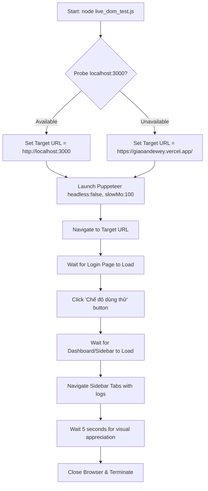

# Design Spec: Puppeteer E2E Live DOM Test

**Date:** 2026-05-24
**Topic:** Puppeteer integration for E2E Live DOM testing on http://localhost:3000 and https://giaoandewey.vercel.app/

---

## 1. Goal
Provide a highly visual, standalone, and easy-to-run E2E test script using Puppeteer. The script must execute in a real browser window (`headless: false`) with a slight action delay (`slowMo: 100`) so that developers and users can easily observe the automated login, navigation, and DOM interactions in real-time.

---

## 2. Requirements & Scope
- **File Name:** `live_dom_test.js` in the root directory.
- **Language:** JavaScript (ES Modules syntax, since the project is configured with `"type": "module"`).
- **Target URL:**
  - Active check: Probe `http://localhost:3000` first.
  - If available: Run the test locally.
  - If unavailable: Fallback automatically to `https://giaoandewey.vercel.app/`.
- **Target Operations:**
  1. Launch Puppeteer in non-headless mode with a custom viewport (1366x768) and a delay of 100ms between actions.
  2. Load the landing/login page.
  3. Wait for the UI components to appear.
  4. Perform the "Demo / Developer Mode" login. This is done by selecting the button with the text "Chế độ dùng thử (Demo / Developer Mode)" and clicking it.
  5. Wait for the main dashboard and the Sidebar navigation panel to load.
  6. Sequentially click through key sidebar tabs (e.g., Dashboard -> Soạn giáo án (creator) -> Thư viện (library) -> Trợ lý AI (chat)) with human-like delays to show off the application features.
  7. Wait for 5 seconds on the final screen.
  8. Clean up and close the browser gracefully.

---

## 3. Tech Stack & Dependencies
- **Puppeteer:** A Node.js library which provides a high-level API to control Chrome/Chromium.
  - Installation: `npm install puppeteer --save-dev`
- **Node.js:** Standard runner (`node live_dom_test.js`).

---

## 4. Detailed Flow Design

---

## 5. Automation Target Selector Mapping
- **Demo Login Button:**
  - Selector/Text: `<button>` containing the text `"Chế độ dùng thử (Demo / Developer Mode)"`.
  - Strategy: Use Puppeteer's text selector or XPath to locate the button precisely.
- **Sidebar Tabs:**
  - Selector: Elements within `<aside>` or buttons matching specific text like `"Soạn giáo án"`, `"Thư viện"`, `"Trợ lý AI"`.
  - Strategy: Target components matching the Sidebar text structure.

---

## 6. Verification
- Run `node live_dom_test.js` and verify:
  1. The browser window launches.
  2. The page loads successfully.
  3. The "Demo" login button is clicked.
  4. The sidebar tabs are clicked.
  5. The execution finishes successfully without errors.
